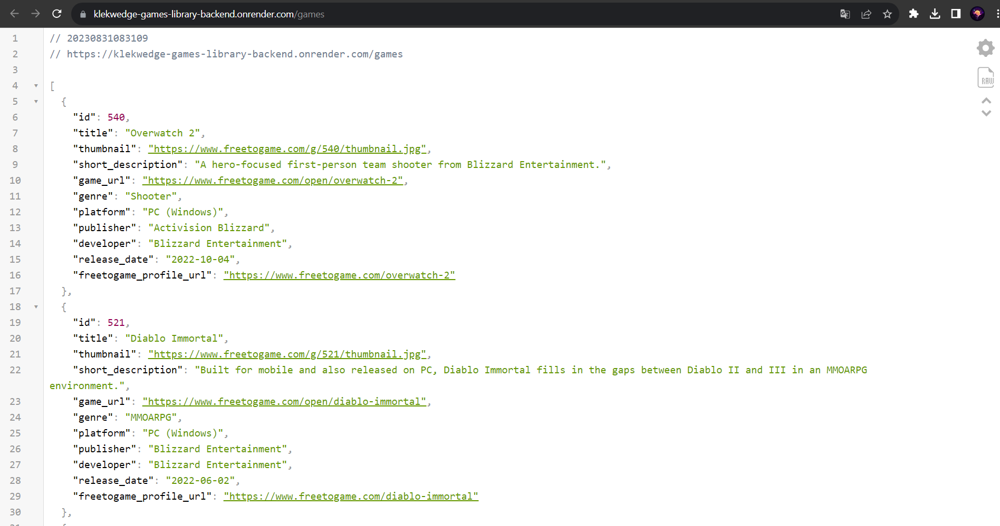

# Games library

**Вы также можете прочитать этот README на [русском](https://github.com/klekwedge/games-library-backend/blob/main/README.md)**

## Table of contents

- [Deployment instructions](#deployment-instructions)
- [Overview](#overview)
  - [Screenshot](#screenshot)
  - [Links](#links)
- [My process](#my-process)
  - [Built with](#built-with)
- [Author](#author)

## Deployment instructions

**To run the project, you need to have [npm](https://nodejs.org/en/) and [git](https://git-scm.com/downloads) installed on your computer**

1. Make a clone of this repository ```git clone https://github.com/klekwedge/games-library-backend.git```
2. Install all required npm packages with ```npm i```
3. Run the project with the command ```npm run start```

## Overview

The API provides access to the following functionality:

- [Getting a list of games](#getting-list-of-games): Allows you to get a list of games.
- [Get a specific game](#get-game): Allows you to get the desired game.

## Getting list of games

`GET /games`

#### Request parameters

- `genre` (optional) - Allows you to get games by genre.
- `platform` (optional) - Allows you to get games by platform.
- `sort` (optional) - Allows you to sort the games.

#### Request example

GET /games?genre=shooter&platform=pc&sort=alphabetical

#### Answer


```
[
  {
    "id": 533,
    "title": "A.V.A Global",
    "thumbnail": "https://www.freetogame.com/g/533/thumbnail.jpg",
    "short_description": "A.V.A is a free-to-play online first-person shooter with multiple game modes, unique customizations, as well as PvP and PvE gameplay.",
    "game_url": "https://www.freetogame.com/open/ava",
    "genre": "Shooter",
    "platform": "PC (Windows)",
    "publisher": "NEOWIZ",
    "developer": "NEOWIZ",
    "release_date": "2022-08-24",
    "freetogame_profile_url": "https://www.freetogame.com/ava"
  },
  {
    "id": 319,
    "title": "Ace Online",
    "thumbnail": "https://www.freetogame.com/g/319/thumbnail.jpg",
    "short_description": "A free to play fast action 3D sci-fi MMO where players control space fighters jets.",
    "game_url": "https://www.freetogame.com/open/ace-online",
    "genre": "Shooter",
    "platform": "PC (Windows)",
    "publisher": "Suba Games",
    "developer": "MasangSoft",
    "release_date": "2008-08-29",
    "freetogame_profile_url": "https://www.freetogame.com/ace-online"
  },
  ...
]
```

## Get game

`GET /game`

#### Request parameters

- `id` (mandatory) - Allows you to uniquely identify the game

#### Request example

GET /game?id=540

#### Answer


```
{
  "id": 540,
  "title": "Overwatch 2",
  "thumbnail": "https://www.freetogame.com/g/540/thumbnail.jpg",
  "status": "Live",
  "short_description": "A hero-focused first-person team shooter from Blizzard Entertainment.",
  "description": "The tale of the hero organization Overwatch continues in Overwatch 2. This new take on the popular team shooter changes up things a little with five-man teams, redefined classes, and new playable characters. With the adjustment to 5v5, players now have more individual impact than in the previous game.\r\n\r\nChallenge yourself in all-new modes. Take control of a robot with your team in Push and take it to the enemy base before the enemy can take it from you. Explore all new areas, including iconic real-world cities such as New York, Rome, Monte Carlo, Toronto, and more.\r\n\r\nOverwatch 2 features an update schedule that drops new content every nine weeks. It also boasts a regular battle pass – both free and premium. This is where some of the game’s characters will be obtained.",
  "game_url": "https://www.freetogame.com/open/overwatch-2",
  "genre": "Shooter",
  "platform": "Windows",
  "publisher": "Activision Blizzard",
  "developer": "Blizzard Entertainment",
  "release_date": "2022-10-04",
  "freetogame_profile_url": "https://www.freetogame.com/overwatch-2",
  "minimum_system_requirements": {
    "os": "Windows 10 64-bit",
    "processor": "Intel Core i3 or AMD Phenom X3 8650",
    "memory": "6 GB",
    "graphics": "NVIDIA GeForce GTX 600 series or AMD Radeon HD 7000 series",
    "storage": "50 GB"
  },
  "screenshots": [
    {
      "id": 1334,
      "image": "https://www.freetogame.com/g/540/overwatch-2-1.jpg"
    },
    {
      "id": 1335,
      "image": "https://www.freetogame.com/g/540/overwatch-2-2.jpg"
    },
    {
      "id": 1336,
      "image": "https://www.freetogame.com/g/540/overwatch-2-3.jpg"
    }
  ]
}
```

### Screenshot



### Links

- [Link to Frontend project](https://github.com/klekwedge/games-library)
- [Deploy Frontend project](https://klekwedge-games-library.vercel.app/)

- [Link to Backend project](https://github.com/klekwedge/games-library-backend)
- [Deploy Backend project](https://klekwedge-games-library-backend.onrender.com/games)

## My process

### Built with

- Node
- Express
- Axios

## Author

- [Website](https://klekwedge-cv.vercel.app/)
- [Linkedin](https://www.linkedin.com/in/klekwedge/)
- [Facebook](https://www.facebook.com/klekwedge)

