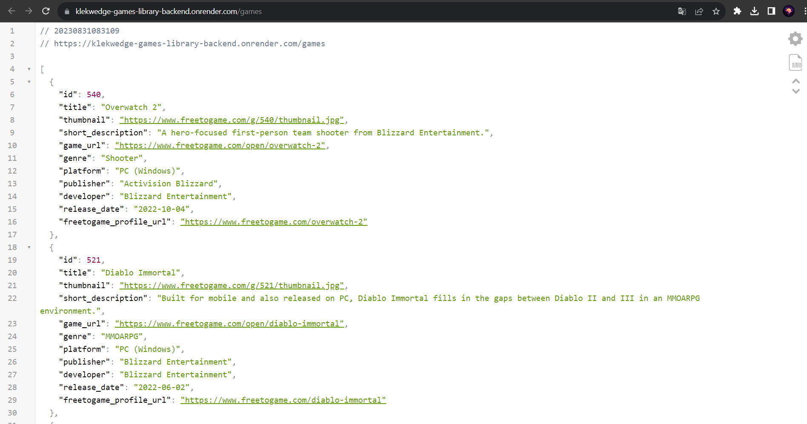

# Games library

**You can also read this README in [English](https://github.com/klekwedge/games-library-backend/blob/main/README.EN.md).**

## Оглавление

- [Инструкции по развертыванию](#инструкции-по-развертыванию)
- [Обзор](#обзор)
  - [Скриншот](#скриншот)
  - [Ссылки](#ссылки)
- [Мой процесс](#мой-процесс)
  - [Стек](#стек)
- [Автор](#автор)

## Инструкции по развертыванию

**Для запуска проекта на вашем компьютере должны быть установлены [npm](https://nodejs.org/en/) и [git](https://git-scm.com/downloads)**

1. Сделайте клон этого репозитория ```git clone https://github.com/klekwedge/games-library-backend.git```
2. Установите все необходимые пакеты npm с помощью ```npm i```
3. Запустите проект командой ```npm run start```

## Обзор

### Скриншот



### Ссылки

- [Ссылка на Frontend проект](https://github.com/klekwedge/games-library)
- [Деплой Frontend проекта](https://klekwedge-games-library.vercel.app/)

- [Ссылка на Backend проект](https://github.com/klekwedge/games-library-backend)
- [Деплой Backend проекта](https://klekwedge-games-library-backend.onrender.com/games)

## Мой процесс

### Стек

- Node
- Express
- Axios

## Автор

- [Вебсайт](https://klekwedge-cv.vercel.app/)
- [Linkedin](https://www.linkedin.com/in/klekwedge/)
- [Facebook](https://www.facebook.com/klekwedge)
